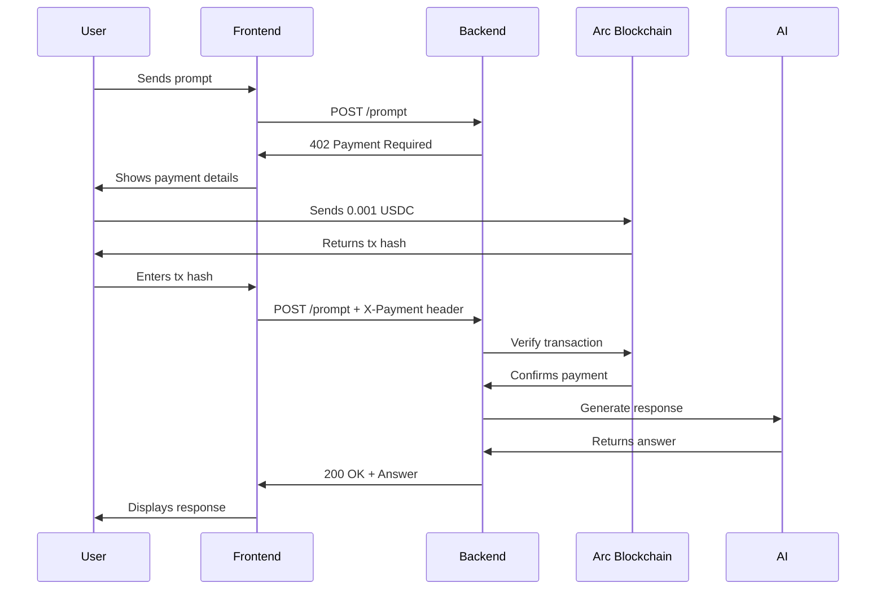

# 🤖 PromptPay AI

**Usage-metered AI agent with on-chain payment verification on Arc**

Pay only when you prompt. No subscriptions, no accounts, no credit cards—just autonomous, trustless micropayments.

[](https://promptpay-five.vercel.app)
[](LICENSE)
[](https://arc.network)

---

## 🎯 Overview

PromptPay AI is an **autonomous AI agent** that requires cryptocurrency micropayments before providing services. It demonstrates the future of **agentic commerce**—where AI agents can transact value independently, without human intervention.

### The Problem We Solve

Traditional AI APIs require:
- ❌ Account signup and KYC
- ❌ Credit card information
- ❌ Monthly subscriptions with minimum commitments
- ❌ Geographic restrictions
- ❌ Trust in centralized payment processors
- ❌ 2-7 day settlement times

### Our Solution

PromptPay AI enables:
- ✅ **Anonymous access** — Just need a crypto wallet
- ✅ **True micropayments** — Pay $0.001 per prompt
- ✅ **Instant settlement** — Verified on-chain in seconds
- ✅ **Global accessibility** — Works anywhere
- ✅ **Autonomous operation** — AI agents can pay other AI agents
- ✅ **Complete transparency** — Every transaction is verifiable on blockchain

---

## 🌟 Key Features

### 🔐 **On-Chain Payment Verification**
Real-time verification of USDC payments on Arc blockchain using Web3.py

### 🛡️ **Transaction Reuse Prevention**
In-memory ledger prevents double-spending at the application level

### 💳 **Credit System**
Automatically tracks overpayments and allows multi-prompt usage from a single transaction

### 📊 **Analytics Dashboard**
Real-time metrics on payments, usage, and revenue

### 🚀 **Sub-second Settlement**
Payments settle on Arc with deterministic finality

### 🌐 **x402 Standard**
Implements HTTP 402 Payment Required for machine-readable payment flows

---

## 🏗️ Architecture

```
┌─────────────┐         ┌──────────────┐         ┌─────────────┐
│   Frontend  │────────▶│   FastAPI    │────────▶│   Gemini    │
│  (Next.js)  │         │   Backend    │         │     AI      │
└─────────────┘         └──────────────┘         └─────────────┘
                               │
                               ▼
                        ┌──────────────┐
                        │   Payment    │
                        │   Ledger     │
                        └──────────────┘
                               │
                               ▼
                        ┌──────────────┐
                        │  Blockchain  │
                        │  Verifier    │
                        └──────────────┘
                               │
                               ▼
                        ┌──────────────┐
                        │     Arc      │
                        │  Blockchain  │
                        └──────────────┘
```

### Backend Stack
- **FastAPI** - High-performance Python web framework
- **Web3.py** - Ethereum/EVM blockchain interaction
- **Google Gemini 2.5 Flash** - AI inference engine
- **Payment Ledger** - In-memory transaction tracking

### Frontend Stack
- **Next.js 14** - React framework with App Router
- **TypeScript** - Type-safe development
- **Tailwind CSS** - Modern styling
- **Recharts** - Data visualization

### Blockchain
- **Arc Testnet** - EVM-compatible L1 with native USDC
- **Circle USDC** - Stablecoin for payments
- **Web3** - Blockchain connectivity

---

## 🚀 Quick Start

### Prerequisites

- Python 3.12+
- Node.js 18+
- Circle Developer Account
- Google Gemini API Key

### Backend Setup

1. **Clone the repository**
   ```bash
   git clone https://github.com/bhavanasanghi9/promptpay.git
   cd promptpay/backend
   ```

2. **Install dependencies**
   ```bash
   pip install -r requirements.txt
   ```

3. **Configure environment variables**
   ```bash
   cp .env.example .env
   ```

   Edit `.env`:
   ```env
   CIRCLE_W3S_API_KEY=your_circle_api_key
   GEMINI_API_KEY=your_gemini_api_key
   AGENT_WALLET_ADDRESS=0xYourAgentWalletAddress
   EXPECTED_PAYMENT_USDC=0.001
   ```

4. **Run the server**
   ```bash
   uvicorn main:app --reload --port 8000
   ```

### Frontend Setup

1. **Navigate to frontend**
   ```bash
   cd ../frontend
   ```

2. **Install dependencies**
   ```bash
   npm install
   ```

3. **Configure environment**
   ```bash
   cp .env.example .env.local
   ```

   Edit `.env.local`:
   ```env
   NEXT_PUBLIC_API_URL=http://localhost:8000
   ```

4. **Run development server**
   ```bash
   npm run dev
   ```

5. **Open browser**
   Navigate to `http://localhost:3000`

---

## 💡 How It Works

### Payment Flow



### Key Components

#### 1. **Blockchain Verifier** (`blockchain_verifier.py`)
- Connects to Arc testnet via RPC
- Verifies transaction existence and success
- Checks correct recipient and amount
- Converts between wei and USDC decimals

#### 2. **Payment Ledger** (`payment_ledger.py`)
- Tracks all payments in-memory
- Prevents transaction reuse
- Manages credit balances
- Records consumption history

#### 3. **FastAPI Backend** (`main.py`)
- Handles HTTP 402 responses
- Orchestrates payment verification
- Manages AI inference
- Provides analytics endpoints

#### 4. **Frontend** (Next.js)
- Wallet state management
- Real-time balance updates
- Payment confirmation polling
- Analytics visualization

---

## 📊 API Reference

### `POST /prompt`

Execute an AI prompt (requires payment).

**Request:**
```json
{
  "prompt": "Explain quantum computing"
}
```

**Headers:**
```
X-Payment: 0xTransactionHashHere (optional)
```

**Response (402 - Payment Required):**
```json
{
  "error": "Payment required",
  "payment": {
    "amount": "0.001",
    "currency": "USDC",
    "chain": "ARC-TESTNET",
    "recipient": "0x170c00dfefced35063b38b62f7705cb868768de5"
  }
}
```

**Response (200 - Success):**
```json
{
  "answer": "Quantum computing is...",
  "receipt": {
    "payment_type": "new_payment",
    "amount_paid": "0.001",
    "amount_consumed": "0.001",
    "remaining_credit": "0.0",
    "tx_hash": "0x...",
    "block_number": 12345
  }
}
```

### `GET /stats`

Get agent statistics.

**Response:**
```json
{
  "total_payments": 5,
  "total_received_usdc": "0.005",
  "total_consumed_usdc": "0.005",
  "total_remaining_credits": "0.0"
}
```

### `GET /payment/{tx_hash}`

Get details about a specific payment.

**Response:**
```json
{
  "tx_hash": "0x...",
  "from": "0xUserWallet...",
  "to": "0xAgentWallet...",
  "total_paid": 0.001,
  "consumed": 0.001,
  "remaining": 0.0,
  "timestamp": 1737331200
}
```

---

## 🔒 Security Features

### Transaction Verification
- ✅ Verifies transaction exists on blockchain
- ✅ Checks transaction succeeded (status = 1)
- ✅ Validates correct recipient address
- ✅ Confirms sufficient payment amount
- ✅ Ensures correct blockchain (Arc testnet)

### Application-Level Protection
- ✅ Transaction hash uniqueness enforcement
- ✅ Credit balance tracking
- ✅ Consumption history logging
- ✅ Rate limiting per wallet (optional)

### Data Integrity
- ✅ Immutable blockchain records
- ✅ Cryptographic transaction signing
- ✅ Public verifiability via block explorer

---

## 📈 Use Cases

### 🤖 **AI-to-AI Commerce**
Autonomous agents can purchase services from other agents without human intervention.

### 💰 **Micropayment APIs**
Enable pay-per-use pricing models that are economically viable at fractions of a cent.

### 🌍 **Global Access**
Provide AI services to anyone with a crypto wallet, regardless of geography or banking status.

### 📊 **Usage-Based Billing**
Fair pricing model—users only pay for what they actually use.

### 🔐 **Anonymous Services**
No KYC, no personal data collection, just wallet-to-wallet transactions.

---

## 🎨 Screenshots

### Main Interface


### Wallet Dashboard


### Analytics


---

## 🧪 Testing

### Run Backend Tests
```bash
cd backend
pytest
```

### Test Payment Flow
```bash
# 1. Start backend
uvicorn main:app --reload

# 2. Test without payment
curl -X POST http://localhost:8000/prompt \
  -H "Content-Type: application/json" \
  -d '{"prompt":"Test"}'

# 3. Test with payment
curl -X POST http://localhost:8000/prompt \
  -H "Content-Type: application/json" \
  -H "X-Payment: 0xYourTxHash" \
  -d '{"prompt":"Test"}'
```

### Get Testnet USDC
Visit [Circle Faucet](https://faucet.circle.com) to get free Arc testnet USDC for testing.

---

## 🛠️ Development

### Project Structure

```
promptpay-ai/
├── backend/
│   ├── main.py                 # FastAPI application
│   ├── blockchain_verifier.py  # Arc blockchain integration
│   ├── payment_ledger.py       # Payment tracking
│   ├── requirements.txt        # Python dependencies
│   └── .env                    # Configuration
├── frontend/
│   ├── app/
│   │   ├── page.tsx           # Main UI
│   │   └── wallet/            # Wallet dashboard
│   ├── lib/
│   │   └── api.ts             # API client
│   └── package.json
└── README.md
```

### Environment Variables

#### Backend (`.env`)
```env
CIRCLE_W3S_API_KEY=          # Circle API key
GEMINI_API_KEY=              # Google Gemini API key
AGENT_WALLET_ADDRESS=        # Your agent's wallet
EXPECTED_PAYMENT_USDC=0.001  # Price per prompt
```

#### Frontend (`.env.local`)
```env
NEXT_PUBLIC_API_URL=http://localhost:8000
```

---

## 🚢 Deployment

### Backend (Render)

1. Create new Web Service
2. Connect GitHub repository
3. Set build command: `pip install -r requirements.txt`
4. Set start command: `uvicorn main:app --host 0.0.0.0 --port $PORT`
5. Add environment variables
6. Deploy

### Frontend (Vercel)

1. Import GitHub repository
2. Framework preset: Next.js
3. Add environment variable: `NEXT_PUBLIC_API_URL`
4. Deploy

---

## 🤝 Contributing

Contributions are welcome! Please follow these steps:

1. Fork the repository
2. Create a feature branch (`git checkout -b feature/amazing-feature`)
3. Commit your changes (`git commit -m 'Add amazing feature'`)
4. Push to the branch (`git push origin feature/amazing-feature`)
5. Open a Pull Request

### Development Guidelines
- Follow PEP 8 for Python code
- Use TypeScript for frontend
- Write tests for new features
- Update documentation

---

## 📝 License

This project is licensed under the MIT License - see the [LICENSE](LICENSE) file for details.

---

## 🙏 Acknowledgments

- **Circle** - For Arc blockchain and USDC infrastructure
- **Google DeepMind** - For Gemini AI models
- **thirdweb** - For x402 facilitator inspiration
- **Hackathon Organizers** - For the opportunity to build this

---

## 📞 Contact

**Project Maintainer:** Bhavana Sanghi (https://github.com/bhavanasanghi9)

**Demo:** https://promptpay-five.vercel.app


## ⚡ Performance

- **Payment Verification:** < 2 seconds
- **AI Response Time:** 2-5 seconds (Gemini 2.5 Flash)
- **Settlement Finality:** < 1 second (Arc)
- **API Latency:** < 100ms

---

## 🔗 Links

- [Arc Documentation](https://docs.arc.network)
- [Circle Developer Portal](https://developers.circle.com)
- [Gemini API Docs](https://ai.google.dev/gemini-api/docs)
- [x402 Standard](https://portal.thirdweb.com/x402)

---

<div align="center">

**Built with ❤️ for the Agentic Commerce on Arc Hackathon**

[⭐ Star this repo](https://github.com/bhavanasanghi9/promptpay) • [🐛 Report Bug](https://github.com/bhavanasanghi9/promptpay/issues) • [💡 Request Feature](https://github.com/bhavanasanghi9/promptpay/issues)

</div>
